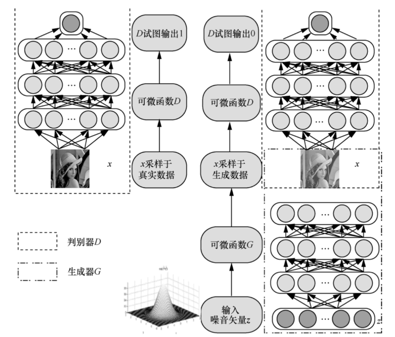
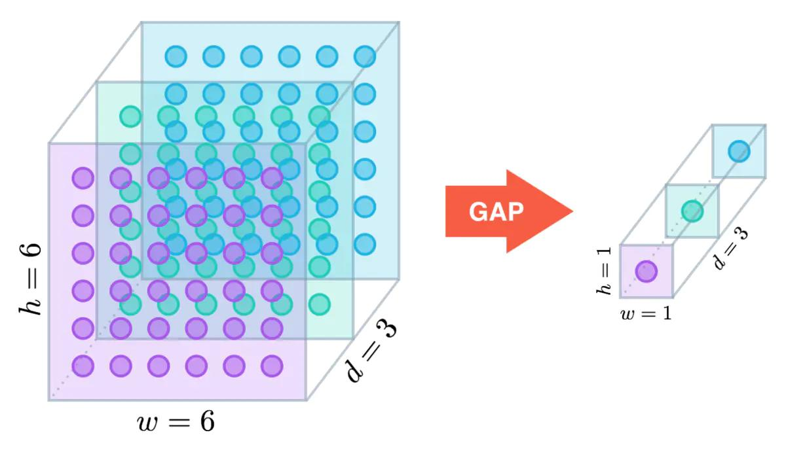

```{r eval=FALSE, include=FALSE}
tinytex::install_tinytex()
```
\newpage

\LARGE

\begin{center}
\textbf{项目管理计划书}
\end{center}

\large
\begin{center}
\textbf{\emph{DCGAN-tensorflow}}
\end{center}

# 项目摘要 {-}
深卷积生成对抗网络的 Tensorflow 实现


# 关键词 {-}

DCGAN（ Deep Convolutional Generative Adversarial Networks）

\normalsize

\newpage

\tableofcontents

\newpage

# 项目概述
## 用户群

1．	项目成员

在本项目中，项员共有以下几位人员：

- 王宸

- 张逸涵

- 张岑媛

- 石睿欣

- 黄慧茹

- 张宏年

- 宋普琦

## 项目 交付产品
（1）提交文档：项目管理计划，需求规格说明等等
（2）源程序检查：检查系统运行情况

## 项目计划书的演化
 - 第一阶段：2020年9月26日-2020年9月28日
   （1）张宏年、宋普琦：完成项目计划书框架，写入Rmd文档中（编译成的PDF文件>10页）
   （2）张岑湲、黄蕙茹：分析DCGan所依赖的算法理论、预测搭建faces demo所需要的技术框架、所需的人员工作量、时间工作量、时间段安排，将这些分析结果以Rmd的形式进行汇总（编译成的PDF文件>10页）
 
 - 第二阶段：2020年9月29日-2020年10月4日
   石睿欣、张逸涵：将上面（2）的内容填充进入（1）中并补充所缺内容，完善成为完整的项目计划书，得到可以提交的PDF文件（编译成的PDF文件>20页）
 
 - 第三阶段：2020年10月5日-2020年10月8日
   王宸：展示

## 参考资料
https://github.com/soumith/dcgan.torch
https://arxiv.org/abs/1511.06434
   

#  技术过程
## 算法理论
https://github.com/soumith/dcgan.torch
https://arxiv.org/abs/1511.06434


## 开发工具与技术框架
- Python 2.7 or Python 3.3+

- Tensorflow 0.12.1

- SciPy

- pillow

- tqdm

- （可选）电影（用于可视化）

- （可选）对齐和裁剪图像.zip ： 大型名人脸数据集

#  项目组织

## 过程模型
| 关键时间 | 任务 | 要求  |
| ------ | ------ | ------ |
| ------ | ------ | ------ |
| ------ | ------ | ------ |
| ------ | ------ | ------ |
| ------ | ------ | ------ |
| ------ | ------ | ------ |
| ------ | ------ | ------ |

## 团队分工与合作
| 成员| 角色 | 职责 |
| ------ | ------ | ------ |
| ------ | ------ | ------ |
| ------ | ------ | ------ |
| ------ | ------ | ------ |
| ------ | ------ | ------ |
| ------ | ------ | ------ |
| ------ | ------ | ------ |
## 人员工作量预估
对早期任务量所需人员的预估

## 人员计划
前端：
后端：
。。。。


# 项目进度及关键工期设置
| 工作集 | 子工作 | 完成时间 |负责人|最终交付物|描述|
| ------ | ------ | ------ | ------ | ------ | ------ |
| ------ | ------ | ------ | ------ | ------ | ------ |
| ------ | ------ | ------ | ------ | ------ | ------ |
| ------ | ------ | ------ | ------ | ------ | ------ |
| ------ | ------ | ------ | ------ | ------ | ------ |
| ------ | ------ | ------ | ------ | ------ | ------ |
| ------ | ------ | ------ | ------ | ------ | ------ |


## 项目时间安排
具体的时间安排

## 软件管理过程中预算及资源分配

## 开发过程资源
人员：
- 王宸

- 张逸涵

- 张岑媛

- 石睿欣

- 黄慧茹

- 张宏年

- 宋普琦
开发地点：寝室、机房
支持软件：Rstudio、Python 2.7 or Python 3.3+、、
实验设备：
训练数据集


# 管理过程

## 管理目标及优先级
    基本管理原则：每位组成员既是积极的建言者，又是负责的合作者，同时也是决策的制定者。决策应在充分的讨论基础上由大家共同做出，一旦决策做出就必须被及时有效的执行。禁止再有异议。
    目标 1：按时按量完成项目的基本功能，按时发布产品及文档，这是本团队的最高目标。 
    目标 2：遵循规范化的项目运作标准，文档严谨完整，代码注释充分，便于后续维护，这是第二目标。
## 会议方式
项目需要小组讨论时，协商空余时间，通过线下、钉钉、腾讯等方式展开会议，并进行会议记录


关键节点的时间安排
##  培训计划
学习使用r-markdowm编写文档，了解DCGAN算法原理及实现

##  风险管理
| 风险类型 | 存在风险 |规避方法|
| 进度风险| 由于时间紧张导致最后项目无法完成| ------ |
| 技术风险|---------------------------------| ------ |
| 质量风险|---------------------------------| ------ |
| 工具风险|---------------------------------| ------ |
| 人力资源风险 |---------------------------------| ------ |

## 监督及控制机制
 整理开发日志等等
 
 
## 计划更新策略
  在本节中，应描述项目计划的更新策略，明确说明项目计划更新的发布方法还要说明项目计划进行变更控制和管理的机制以及其载体。
  
在发生如下事件时，修订项目计划和参考文档:
1、到达某里程碑，在每个阶段结束后如思必要的话修订项目计划。
2、项目的范围发生安化
3、当风险成为现实时采取了相应的行动
4、当进度、工作量超出控制的范围并需要采取纠正行动时
## 质量保证活动
内部审核
阶段审核


# GAN
生成式对抗网络GAN是一种生成式模型，灵感来自于零和博弈的思想。整个系统由两部分组成，生成模型G和判别模型D，通过两者的博弈，来使生成模型学习到数据的分布。
生成模型仿照真实数据样本的分布，从一个随机噪声z中生成一个输入并训练自己骗过判别模型，使之认为其生成的输入都是真实的，而判别模型则试图区分真实输入与生成的输入。原始的GAN中，生成模型和判别模型都为多层感知机，结构如图1.



GAN的目标函数如图2，是一个极小极大博弈问题。


其中，Pdata 是真实数据分布，Pz 是噪声分布，G(z) 是生成模型根据随机噪声z 生成的模拟真实数据的假数据，D(x) 是判别模型判断真实数据为真的概率，D(G(z)) 是判别模型判断造假数据为真的概率。
对于判别模型D，它的目标是将真实数据判断为真，将生成模型生成的数据判断为假，也就是使式子取值尽可能大。对于生成模型G，它的目标是生成的数据能够欺骗判别模型，使式子取值尽可能小。在两个模型对抗的过程中，各自的生成能力和判别能力都在提高。
训练过程中，交替地对生成模型和判别模型进行训练。固定生成模型G，通过梯度下降优化判别模型D，再固定判别模型D，优化生成模型G，直到达到纳什均衡。

# DCGAN
在DCGAN的生成模型和判别模型中，使用卷积神经网络（CNN）来代替传统GAN中的多层感知机。
对于生成模型G，它的输入是一个100维的向量z。生成模型的第一层是一个全连接层，将100维的向量变为4×4×1024的输出，从第二层开始，使用微步卷积（fractional-strided convolution）来进行上采样，逐渐减少通道数，最后输出为64×64×3的矩阵。
生成模型的结构如图3。


判别模型D的输入是一张图像，经过步长卷积下采样，逐渐增加通道数，最后得到的卷积特征通过全连接层，输出一个值用来判断图像是真实数据或生成的数据，结构如图4.


## 步长卷积和微步卷积
在DCGAN中，没有使用池化层，而是以步长卷积来进行下采样。
在生成模型中，使用了微步卷积（fractional-strided convolutions）来进行上采样。上采样即去卷积，目的是将经过池化层以后缩小的矩阵扩大到一定的大小，包含转置卷积和微步卷积两种方法。以将3×3的矩阵扩大到5×5为例，去卷积的过程如图5。


而转置卷积和微步卷积的主要差别在于填充的方式不同，如图6。


在判别模型中，使用了步长卷积（strided convolution），步长即滤波器每次移动的距离。以7×7的矩阵为例，步长为2的情况下，最后会得到3×3的输出。如图7.


## 批标准化
批标准化通过一定的规范化手段，将每一层的输入变换到均值为0，标准差为1的标准正态分布，可以使训练变得稳定，帮助解决不好的初始化带来的问题，使梯度可以在更深的模型中传递。这是因为整体分布逐渐向非线性的激活函数的取值区间的上下限两端趋近时，会导致反向传播时低层神经网络梯度消失，而批标准化使激活函数输入值落座在对输入较敏感的区域。同时，梯度变大意味着学习收敛速度快，能加快训练速度。
为了保证网络的表达能力，对变换后，满足均值为0，标准差为1的x再次进行操作y=scale*x+shift，scale和shift两个参数通过训练学习到。
批标准化的具体操作流程如图8。


GAN可能出现崩溃问题，生成器总是生成同样的样本点，无法继续学习。以图9为例，右图的十个团簇代表mnist数据集的10个模式，生成模型如果只能生成其中的几个数字而遗漏其他模式，便是出现了模式崩溃。批标准化可以避免这种问题。


在每一层应用批标准化会导致震荡和不稳定性，所以在生成模型的输出层和判别模型的输入层不使用批标准化。

## 全连接层
长久以来，全连接层一直是CNN的标配结构，在常见的卷积神经网络中，传统的做法是在负责对图像进行特征提取的卷积层后设置全连接层，之后再进行激活分类。但近年来也有去除全连接层的趋势，比如使用全局平均池化来替代全连接层。


其主要思想即对于输出的每一个通道的特征图的所有像素计算一个平均值，用该数值代表对应的特征图。



相较于全连接层，全局平均池化可以接受任意尺寸的图像，降低了参数量，由于全局平均池化层没有参数，也可防止在该层过拟合，同时，整合了全局空间信息，还可以更好地将类别与最后一个卷积层的特征图对应起来。但在增加了模型稳定性的同时，全局平均池化有可能降低收敛速度。因此，最终选择了直接使用卷积层连接生成器和判别器的输入层以及输出层。

## 激活函数
激活函数的主要功能是提供网络的非线性建模能力，如果没有激活函数，网络只能表达线性映射，可以认为只有加入了激活函数之后深度神经网络才具备了分层的非线性映射学习能力。DCGAN在生成器网络中选用ReLU作为激活函数，最后一层使用Tanh。
Tanh即双曲正切函数，它的输出和输入能够保持非线性单调上升和下降关系，输出以0为中心，比Sigmoid函数收敛速度更快，但还是没有改变Sigmoid函数最大的问题，即由于饱和性产生的梯度消失。


而ReLU有效缓解了梯度消失的问题，提供了神经网络的稀疏表达能力，且相较于Tanh，在SGD中能快速收敛。


GAN在判别器网络中选用了Maxout作为激活函数，它的拟合能力非常强，具有ReLU的所有优点，即线性、不饱和性，同时不会导致神经元死亡，但它会导致整体参数的数量激增。


与此相对，DCGAN选用了LeakyReLU作为激活函数，LeakyReLU也解决了神经元死亡的问题，同时，实现更为简单，在实验中表现也更好。


# 工作量评估
总工作量
任务|工作量（人天）
------|------
使用TensorFlow搭建模型|6
获取和处理数据集|5
实现Demo|12


工作量分解
任务|补充说明|需求分析|开发|测试
------|------|------|------|------
搭建生成模型|使用TensorFlow搭建DCGAN的生成器|无|王宸|张逸涵
搭建判别模型|使用TensorFlow搭建DCGAN的判别器|无|张岑湲|王宸
直接获取数据集|训练使用的数据集包括LSUN数据集，ImageNet 1k和celebA数据集|无|石睿欣|宋普琦
构造数据集|爬取网上社区的图片，通过openface进行修剪来构造数据集|无|张逸涵|石睿欣
预处理数据集|调整图像大小，进行图像标准化处理|无|黄蕙茹|张宏年
训练模型|通过优化目标函数训练模型|无|宋普琦|张岑湲
调整模型参数|调整参数进行多次训练，在验证集和测试集上进行测试来找到性能最好的参数|无|张宏年|宋普琦
实现Demo前端|前端需要实现一个网页，主要功能为展示生成的图像，并能显示其对应的输入z；前端网页使用vue框架来实现|张逸涵|石睿欣|王宸
实现Demo后端|后端需要提供相应接口，使网页能够获取图像与对应的输入|张岑湲|王宸|黄蕙茹


项目进度计划
任务名称|耗时（天）|开始|结束
------|------|------|------
DCGAN|31|2020-9-26|2020-10-26
项目分析|5|2020-9-26|2020-9-30
搭建模型|7|2020-10-8|2020-10-14
获取与处理数据集|5|2020-10-10|2020-10-14
实现Demo|14|2020-10-13|2020-10-26

