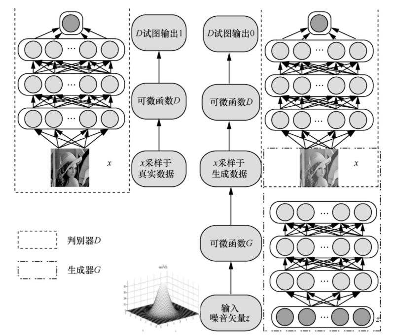
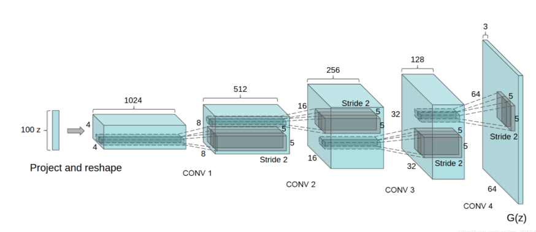
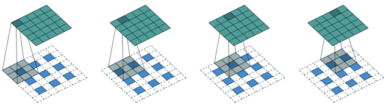
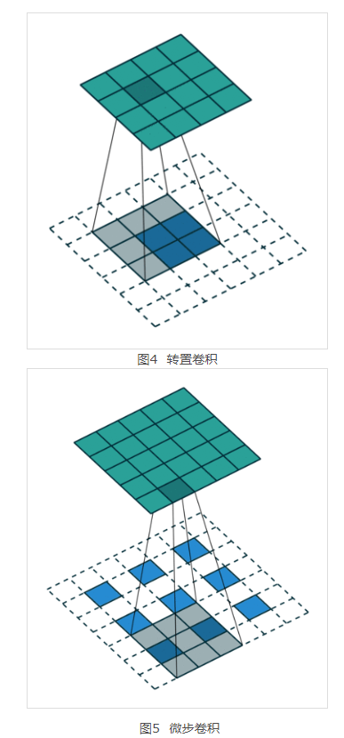
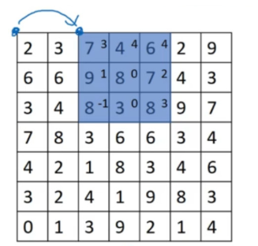
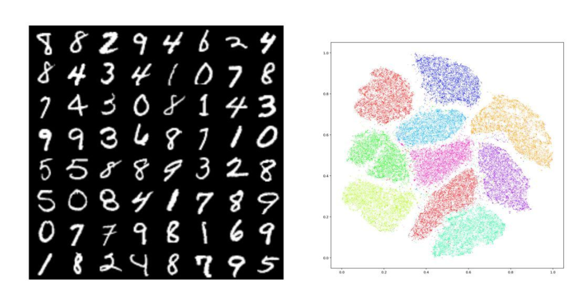
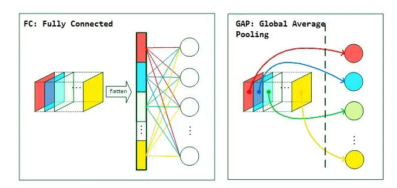
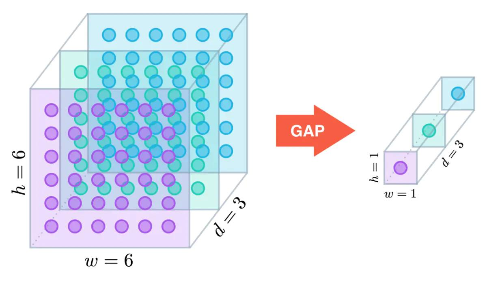
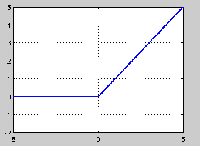

---
title: \vspace{2in} 项目管理计划书
subtitle: "FaceGen: A face image generator website based on GAN"
author:
  - Shi, Ruixin^[Equal Contribution, Fudan University, 17302010065 (rxshi17@fudan.edu.cn)]
  - Zhang, Cenyuan^[Equal Contribution, Fudan University, 17302010068 (cenyuanzhang17@fudan.edu.cn)]
  - Zhang, Yihan^[Equal Contribution, Fudan University, 17302010076 (zhangyihan17@fudan.edu.cn)]
  - Wang, Chen^[Equal Contribution, Fudan University, 16307110064 (wangc16@fudan.edu.cn)]
  - Zhang, Hongnian^[Equal Contribution, Fudan University, 17302010061 (17302010061@fudan.edu.cn)]
  - Song, Puqi^[Equal Contribution, Fudan University, 17302010037 (17302010037@fudan.edu.cn)]
  - Huang, Huiru^[Equal Contribution, Fudan University, 17302010080 (17302010080@fudan.edu.cn)]
  - Tian, Ziwei^[Equal Contribution, Fudan University, 17302010071 (17302010071@fudan.edu.cn)]
date: "2020年10月8日"
documentclass: ctexart
output:
  rticles::ctex:
    fig_caption: yes
    number_sections: yes
    keep_md: yes
    keep_tex: yes
    extra_dependencies:
      multirow: null
      float: null
classoption: "hyperref, a4paper"
bibliography: biblio.bib
header-includes:
   - \usepackage{array}
   - \usepackage{amsmath}
---

\newpage

\LARGE

\begin{center}
\textbf{项目管理计划书}
\end{center}

\large
\begin{center}
\textbf{\emph{FaceGen: A face image generator website based on GAN}}
\end{center}

# 项目摘要 {-}
随着互联网的发展，各种应用的出现，人们对塑造个性化的虚拟形象、定制具有某些特征的头像的需求也随之增多，生成的头像可以用于各类应用中，人脸生成这一项任务应运而生。
人脸生成任务可以通过生成式模型来完成。与判别式模型不同，生成式模型学习并表达训练数据集的分布，通过这一分布生成数据，产生更多的样本。
我们选取了生成式对抗网络用于我们的项目中，生成式对抗网络的灵感来自于零和博弈，模型由两部分组成，生成模型G和判别模型D，两者互相博弈，生成模型仿照真实数据样本的分布，从一个随机噪声z中生成一个输入并训练自己骗过判别模型，使之认为其生成的输入都是真实的，而判别模型则试图区分真实输入与生成的输入。这样，生成式对抗网络解决了传统生成模型遇到的两个困难。
相较于传统的生成式对抗网络，我们选用的模型用卷积神经网络代替了多层感知机，并采用了反卷积、批标准化、全局池化层等技术，提升了训练的稳定性，也使更高分辨率和层数更深的生成模型成为可能。
针对人脸生成任务，我们使用tensorflow来搭建模型，采用LSUN数据集，ImageNet1k和celebA数据集来对模型进行训练，最终得到能够产生人脸的图像的生成器。并且在训练好的模型的基础上，我们将会完成一个前端网页，以可视化输入生成器的噪声向量并方便用户调整输入，以及在网页上展示生成器最终生成的图像，让用户能够对模型的性能有直观的了解。

# 关键词 {-}

GAN(Generative Adversarial Networks); Deep Learning; Face Generation

\normalsize

\newpage

\tableofcontents

\newpage

# 项目概述
## 用户群

近些年来，随着互联网产业的发展，人们对于人脸需要越来越高，捏脸系统，自拍P图……人们需要塑造出具有个性化的虚拟形象，利用符号化的自我定制，表达出自我特征。我们的项目就是想为这些用户提供一种制作指定特征人脸的服务平台，满足用户定制虚拟人脸需求。

## 项目 交付产品
+ 提交文档：项目管理计划，需求规格说明
+ 源程序检查：检查系统运行情况

## 项目计划书的演化
 - 第一阶段：2020年9月26日-2020年9月28日
 \newline
   （1）张宏年、宋普琦：完成项目计划书框架，写入Rmd文档中
   \newline
   （2）张岑湲、黄蕙茹：分析DCGan所依赖的算法理论、预测搭建faces \newline demo所需要的技术框架、所需的人员工作量、时间工作量、时间段安排，将这些分析结果以Rmd的形式进行汇总
 
 - 第二阶段：2020年9月29日-2020年10月4日
 \newline
   石睿欣、张逸涵：将上面（2）的内容填充进入（1）中并补充所缺内容，完善成为完整的项目计划书，得到可以提交的PDF文件
 
 - 第三阶段：2020年10月5日-2020年10月8日\newline
   王宸：展示
   
## 项目背景

生成式对抗网络（GAN）是一种生成式模型。生成式模型学习并表达训练数据集的分布，通过这一分布生成数据，产生更多的样本。但传统的生成式模型会遇到两个困难，一是对真实世界的建模好坏会影响模型的性能，而建模需要大量先验知识。二是由于真实世界的数据的复杂性，拟合模型往往需要需要很大的计算量。生成式对抗网络通过两个网络，判别器和生成器的对抗解决了以上两个问题。
在GAN的基础上，2016年提出了DCGAN模型，用卷积神经网络（CNN）代替传统GAN中的多层感知机，采用了反卷积、批标准化、全局池化层等技术，提升训练的稳定性，并使更高分辨率和层数更深的生成模型成为可能。
DCGAN的生成器接受一个一百维的噪声向量，生成一张64×64×3的图片。作为其的一个应用，我们选择了常见的人脸生成任务作为我们项目的目标。人脸生成任务具有代表性，如果能完成这一任务，说明模型具有学习训练集分布并产生更多数据的能力。
我们采用LSUN数据集，ImageNet 1k和celebA数据集来对模型进行训练，使生成器产生人脸的图像。在训练好的模型的基础上，我们将会完成一个前端的网页用于展示模型的效果。通过10×10的方框的灰度，将用于生成图像的噪声向量可视化，也方便用户进行修改。网页将向量传到后端的模型，获得生成的图片并展示出来，用户就可以直观地感受到模型在人脸生成任务上的表现。

## 参考资料
- URL:https://github.com/soumith/dcgan.torch
- URL:https://arxiv.org/abs/1511.06434
- URL:https://github.com/TadasBaltrusaitis/OpenFace

   

#  技术过程
## 算法理论
我们使用深度卷积生成对抗网络进行无监督表示学习，并将其应用在计算机视觉中。我们选取生成式对抗网络GAN。GAN是一种生成式模型，灵感来自于零和博弈的思想。整个系统由两部分组成，生成模型G和判别模型D，通过两者的博弈，来使生成模型学习到数据的分布。生成模型仿照真实数据样本的分布，从一个随机噪声z中生成一个输入并训练自己骗过判别模型，使之认为其生成的输入都是真实的，而判别模型则试图区分真实输入与生成的输入。
在DCGAN的生成模型和判别模型中，使用卷积神经网络（CNN）来代替传统GAN中的多层感知机。对于生成模型 G，它的输入是一个 100 维的向量 z。生成模型的第一层是一个全连接层，将 100维的向量变为 4×4×1024的输出，从第二层开始，使用微步卷积（fractional-strided convolution）来进行上采样，逐渐减少通道数，最后输出为64×64×3的矩阵。判别模型D的输入是一张图像，经过步长卷积下采样，逐渐增加通道数，最后得到的卷积特征通过全连接层，输出一个值用来判断图像是真实数据或生成的数据。
在数据库的选择上，我们选取OpenFace –一种旨在用于计算机视觉和机器学习研究人员，情感计算社区以及对基于面部行为分析构建交互式应用程序感兴趣的人们的工具。OpenFace是第一个工具包，它能够进行脸部界标检测，头部姿势估计，脸部动作单位识别和注视估计，并具有用于运行和训练模型的可用源代码。此外他还具有实时性能，并且可以通过简单的网络摄像头运行，而无需任何专业硬件。非常适合我们的项目使用。
\newline

- https://github.com/soumith/dcgan.torch
- https://arxiv.org/abs/1511.06434

## 开发工具与技术框架
- Python 2.7 or Python 3.3+

- Tensorflow 0.12.1

- SciPy

- pillow

- tqdm

- Vue.js

- Java

- （可选）对齐和裁剪图像.zip ： 大型名人脸数据集

#  项目组织

## 过程模型
\begin{table}[H]
\small 
\begin{center}  
\begin{tabular}{|p{1.5cm}|p{3cm}|p{5cm}|}  
\hline  
 关键时间 & 任务 & 要求  \\ \hline  
2020-9-26 & 项目分析开始 & 由9月26日开始，项目正式启动，相关人员开始进行项目计划设计以及相关理论研究\\  \hline
2020-9-30 & 项目分析结束 & 到9月30日，项目分析基本结束，前期准备工作告一段落\\  \hline
2020-10-8 & 搭建模型启动 & 到10月8日休息结束，相关人员开始进行项目模型搭建\\  \hline
2020-10-10 & 获取与处理数据集& 10月10日，开始进行数据获取与分析 \\  \hline  
2020-10-13 & 开始实现Demo& 10月13日开始进行网站设计开发工作 \\  \hline  
2020-10-14 & 搭建模型与处理数据集结束& 10月14日计划已完成使用TensorFlow搭建DCGAN的生成器以及判别器和数据准备工作 \\  \hline  
2020-10-26 & 项目实现结束 & 截止到10月26日模型调优结束，网站搭建完毕可以上线使用 \\ \hline  
\end{tabular}  
\end{center}  
\end{table}

## 团队分工与合作
\begin{table}[H]
\small 
\begin{center}  
\begin{tabular}{|p{1.5cm}|p{3cm}|p{5cm}||p{5cm}|}  
\hline 
成员 & 角色 & 职责 & 个人背景介绍    \\ \hline  
王宸 & 项目经理 & 负责整个项目的计划、实施和控制，确保项目有质量地按时完成，参与系统设计网站搭建 
& 在深度学习，神经网络，后端开发，web开发等方面均有丰富的国际学术交流项目经验，竞赛项目经验及个人独立开发项目经验；曾获得全国数学建模竞赛一等奖等各种奖项，复旦大学优秀学生奖学金等诸多奖金；擅长java，C，C++，Python，SQL，PHP，JS，CSS，HTML。    \\ \hline
黄蕙茹、石睿欣  & 模型结构设计师&负责逻辑模型和物理模型设计，保障系统架构和数据架构稳定 &黄蕙茹：
擅长java，C，C++，Python，SQL，PHP，JS，CSS，HTML，有丰富的项目经历及开发经验。
石睿欣： 擅长JAVA, C++, PHP, JS，Python, C, Verilog， Matlab，有丰富的项目经历与开发经验。曾获复旦大学优秀学生奖学金二等奖。曾获2019微信小程序应用开发赛华东赛区二等奖。    \\ \hline
张岑湲、田紫薇& 模型优化 & 负责项目模型持续优化工作 & 张岑湲：
擅长java，PHP，JS，CSS，HTML，tensotflow，有丰富的项目经历及开发经验。曾获复旦大学优秀学生奖学金。 田紫薇：
擅长java，python，HTML，CSS，JS，有丰富的项目经历及一定的开发经验。\\ \hline
张宏年 & UI设计 & 负责项目的人机交互、操作逻辑和界面的整体设计工作 & 
熟悉java，python，HTML，CSS，JS，有丰富的项目经历及一定的开发经验。\\ \hline
张逸涵 & 前端开发 & 负责项目前端开发 & 擅长Java, C/C++, Python, kotlin,HTML, CSS, JavaScript, PHP, JavaEE，MySQL，有丰富的项目经历与开发经验。曾获2019微信小程序应用开发赛华东赛区二等奖。兼具企业实习及实验室研发经验。 \\ \hline
宋普琦 & 后端开发 & 负责项目后端开发 & 熟悉java，C++，HTML，CSS，JS，有丰富的项目经历及一定的开发经验。 \\ \hline

\end{tabular}  
\caption{成员分工与合作} 
\end{center}  
\end{table}
## 人员工作量预估
对早期任务量所需人员的预估

任务|工作量（人天）
------|------
项目分析|4
理论研究|4
项目计划书书写|4
展示准备|1

## 人员计划

|职责|人数|
|:---|:---|
|管理人员|1人|
|模型结构设计|5人|
|模型优化|2人|
|UI设计|1人|
|前端开发|2人|
|后端开发|3人|

# 项目进度及关键工期设置
## 项目时间安排

\begin{table}[H]
\small 
 
\begin{center}
\begin{tabular}{|p{1.5cm}|p{3cm}|p{1.5cm}|p{1.5cm}|p{2cm}| p{2cm}|}  
\hline  
工作集 & 子工作 & 完成时间 & 负责人 & 最终交付物 & 描述 \\ \hline  
\multirow{3}*{准备} & 确定小组 & 第一周 & 王宸 & 小组成员名单 & 成立开发团队\\ 
\cline{2-6}
~ & 搭建环境 & 第三周 & 组内各成员 & Tenserflow运行环境 & 确定开发环境 \\
\cline{2-6}
~ & 制定项目管理计划书 & 第三周 & 王宸 & 《项目管理计划书初稿》& 确定开发过程的规划\\
\hline
\multirow{2}*{确定需求} & 分析项目需求 & 第三周 & 张岑湲 & 项目初步需求 & 通过查阅资料了解项目及项目的开发需求\\
\cline{2-6}
~ & 需求规格说明的确认 & 第四周 & 张岑湲 & 《需求规格说明书初稿》 & 确定项目需求 \\
\hline
\multirow{3}*{系统设计} & 前端展示界面设计 & 第五周 & 张逸涵 & 展示网页模版 & 确定项目用于展示的网页的样子\\
\cline{2-6}
~ & DCGAN模型设计 & 第五周 & 张岑湲 & 模型构造与数据集 & 确定模型的层次以及需要的数据集\\
\cline{2-6}
~ & 系统总体设计 & 第五周 & 王宸 & 《软件设计报告初稿》 & 制定系统总体的设计方法并与需求相关联\\
\hline
\multirow{3}*{系统开发} & DCGAN模型训练 & 第八周 & 王宸 & 源代码 & 提供训练完成的模型\\
\cline{2-6}
~ & DCGAN模型验证与参数优化 & 第十一周 & 张岑湲 & 源代码 & 提供一定精读的项目可用模型\\
\cline{2-6}
~ & 前端展示网页开发 & 第十三周 & 张逸涵 & 源代码 & 提供前端展示平台\\
\hline 
系统测试 & 前后端集成与测试 & 第十四周 & 王宸 & 完整可展示的项目 & 测试整个系统的情况 \\
\hline
系统交付 & 系统交付 & 第十五周 & 王宸 & 可运行系统，用户手册，技术文档 & 最终产品的交付 \\
\hline

\end{tabular}  
\caption{项目进度表} 
\end{center}  
\end{table}

## 软件管理过程中预算及资源分配

+ 系统开发不涉及任何经济预算，工程量为 6人/天 。
+ 资源分配：使用各自的电脑进行开发，计算过程由远端服务器完成。

## 项目进度及关键工期设置

+ 准备工作：
  - 时间：第一周到第三周
  - 关键工期：项目管理计划初稿发布

+ 需求分析：
  - 时间：第三周到第四周
  - 关键工期：需求规格说明书初稿发布

+ 系统设计：
  - 时间：第四周到第五周
  - 关键工期：系统设计初稿发布
  
+ 源代码开发与测试：
  - 时间：第六周到第十三周
  - 关键工期：代码开发与测试

+ 系统集成：
  - 时间：第十三周到第十四周
  - 关键工期：系统成功测试
  
+ 软件交付：
  - 时间：第十四周到第十五周
  - 关键工期：系统能成功并稳定运行

## 开发过程资源
+ 人力资源：王宸、张逸涵、张岑湲、石睿欣、黄慧茹、张宏年、宋普琦
+ 场地资源：软件机房
+ 软件资源：Rstudio、Tenserflow
+ 数据资源：OpenFace Dataset
+ 计算资源：4 Nvidia Tesla T4 GPU with 16GB RAM each CUDA computation Training

# 管理过程

## 管理目标及优先级

+ 按时按量完成项目的基本功能，按时发布产品及文档，这是本团队的最高目标。
+ 遵循规范化的项目运作标准，文档严谨完整，代码注释充分，便于后续维护，这是第二目标。
+ 产品运行稳定，界面友好，用户易操作。
+ 注重团队建设，成员分工合理，团队成员合作默契，气氛融洽。每周的讨论会积极建言。在开发过程中积极协作。
+ 项目设计和开发上有创新，有亮点。

## 会议方式
每周小组将通过钉钉会议展开讨论，并进行会议记录。

##  风险管理

\begin{table}[H]
\small 
\begin{center}  
\begin{tabular}{|p{1.5cm}|p{3cm}|p{5cm}|}  
\hline  
风险类型 & 存在风险 & 规避方法  \\ \hline  
进度风险 & 由于课程紧张导致最后项目无法如期完成 & 合理规划时间并在每个阶段预留空余时间 \\ \hline  
技术风险 & 由于技术熟练程度不够导致风险 & 由专业的技术人员王宸辅导组员在代码开发上的问题 \\  \hline  
质量风险 & 模型训练结果不理想 & 由专业的技术人员张岑湲、王宸共同监管项目质量 \\  \hline  
工具风险 & 模型训练服务器运行过慢，数据集无法获取 & 设置备用的工具 \\  \hline  
人力资源风险 & 人员因故不能参与开发 & 小组共7人，工程量设置为6人/天，留有空余 \\  \hline  
\end{tabular}  
\end{center}  
\end{table}

## 监督及控制机制

+ 组员需以周为单位记录个人工作进展。
+ 小组会议以周为单位展开，各组员需要汇报，沟通交流一周成果，遇到的问题等。
+ 组长对组员的汇报进行整合，通过组内讨论提出项目潜在问题，解决方式与下周目标。
+ 专人负责对每次会议内容进行记录。
 
## 计划更新策略

在发生如下事件时，修订项目计划和参考文档:

+ 到达某里程碑，在每个阶段结束后如果必要的话修订项目计划
+ 项目的范围发生变化
+ 当风险成为现实时采取了相应的行动
+ 当进度、工作量超出控制的范围并需要采取纠正行动时

## 质量保证活动
+ 内部审核
  - 组员对自己的开发代码进行审核，并组内成员互相审核正确性。
+ 阶段审核
  - 项目到达里程碑阶段时由组长再次进行审核。

# 技术实施方案
## GAN
生成式对抗网络GAN是一种生成式模型，灵感来自于零和博弈的思想。整个系统由两部分组成，生成模型$G$和判别模型$D$，通过两者的博弈，来使生成模型学习到数据的分布。
生成模型仿照真实数据样本的分布，从一个随机噪声$z$中生成一个输入并训练自己骗过判别模型，使之认为其生成的输入都是真实的，而判别模型则试图区分真实输入与生成的输入。原始的GAN中，生成模型和判别模型都为多层感知机，结构如图1.

GAN的目标函数如下，是一个极小极大博弈问题。

$$\mathop{\min}\limits_{G} \mathop{\max}\limits_{D}\mathit{V(D,G)} = E_{x\sim p_{data}(x)}[ \mathrm{log} D(x)]+E_{z\sim p_z(z)}[ \mathrm{log}(1-D(G(z)))]$$

其中，$P_{data}$ 是真实数据分布，$Pz$ 是噪声分布，$G(z)$ 是生成模型根据随机噪声$z$生成的模拟真实数据的假数据，$D(x)$ 是判别模型判断真实数据为真的概率，$D(G(z))$ 是判别模型判断造假数据为真的概率。
对于判别模型$D$，它的目标是将真实数据判断为真，将生成模型生成的数据判断为假，也就是使式子取值尽可能大。对于生成模型$G$，它的目标是生成的数据能够欺骗判别模型，使式子取值尽可能小。在两个模型对抗的过程中，各自的生成能力和判别能力都在提高。
训练过程中，交替地对生成模型和判别模型进行训练。固定生成模型$G$，通过梯度下降优化判别模型$D$，再固定判别模型$D$，优化生成模型$G$，直到达到纳什均衡。[@goodfellow2014generative]

## DCGAN
在DCGAN的生成模型和判别模型中，使用卷积神经网络（CNN）来代替传统GAN中的多层感知机。
对于生成模型$G$，它的输入是一个100维的向量$z$。生成模型的第一层是一个全连接层，将100维的向量变为4×4×1024的输出，从第二层开始，使用微步卷积（fractional-strided convolution）来进行上采样，逐渐减少通道数，最后输出为64×64×3的矩阵。
生成模型的结构如图3。

判别模型D的输入是一张图像，经过步长卷积下采样，逐渐增加通道数，最后得到的卷积特征通过全连接层，输出一个值用来判断图像是真实数据或生成的数据，结构如图4.[@radford2015unsupervised]

### 步长卷积和微步卷积
在DCGAN中，没有使用池化层，而是以步长卷积来进行下采样。
在生成模型中，使用了微步卷积（fractional-strided convolutions）来进行上采样。上采样即去卷积，目的是将经过池化层以后缩小的矩阵扩大到一定的大小，包含转置卷积和微步卷积两种方法。以将3×3的矩阵扩大到5×5为例，去卷积的过程如图5。

而转置卷积和微步卷积的主要差别在于填充的方式不同，如图6。

在判别模型中，使用了步长卷积（strided convolution），步长即滤波器每次移动的距离。以7×7的矩阵为例，步长为2的情况下，最后会得到3×3的输出。如图7。[@springenberg2014striving]

### 批标准化
批标准化通过一定的规范化手段，将每一层的输入变换到均值为0，标准差为1的标准正态分布，可以使训练变得稳定，帮助解决不好的初始化带来的问题，使梯度可以在更深的模型中传递。这是因为整体分布逐渐向非线性的激活函数的取值区间的上下限两端趋近时，会导致反向传播时低层神经网络梯度消失，而批标准化使激活函数输入值落座在对输入较敏感的区域。同时，梯度变大意味着学习收敛速度快，能加快训练速度。
为了保证网络的表达能力，对变换后，满足均值为$0$，标准差为$1$的$x$再次进行操作$y=scale*x+shift$，$scale$和$shift$两个参数通过训练学习到。
批标准化的具体操作流程如图8。[@ioffe2015batch]

$$
\begin{aligned}&\mathbf{Input}:\mathrm{Values\ of\ } x \mathrm{over\ a\ minibatch:}\mathcal{B}=\{x_1…m\};\mathrm{Parameters\ to\ be\ learned:}\gamma,\beta \\&\mathbf{Output:}\{y_i=\mathrm{BN_{\gamma,\beta}}(x_i)\}\end{aligned}
$$

$$
\begin{aligned}
&\mu_\mathcal{B}\gets\frac{1}{m}\sum_{i = 1}^{m}x_i \qquad\mathrm{//minibatch\ mean} \\
&\sigma^2_\mathcal{B}\gets\frac{1}{m}\sum_{i = 1}^{m}(x_i-\mu_\mathcal{B})^2\qquad \mathrm{//minibatch\ variance} \\
&\hat{x_i} = \frac{x_i -\mu_\mathcal{B} }{\sqrt{(\sigma_\mathcal{B})^2 + \epsilon}} \qquad\mathrm{//normalize}\\
&y_i\gets\gamma\hat{x_i} + \beta\equiv\mathrm{BN_{\gamma,\beta}}(x_i)\qquad \mathrm{//scale\ and\ shift}
\end{aligned}
$$

GAN可能出现崩溃问题，生成器总是生成同样的样本点，无法继续学习。以图9为例，右图的十个团簇代表mnist数据集的10个模式，生成模型如果只能生成其中的几个数字而遗漏其他模式，便是出现了模式崩溃。批标准化可以避免这种问题。

在每一层应用批标准化会导致震荡和不稳定性，所以在生成模型的输出层和判别模型的输入层不使用批标准化。

### 全连接层
长久以来，全连接层一直是CNN的标配结构，在常见的卷积神经网络中，传统的做法是在负责对图像进行特征提取的卷积层后设置全连接层，之后再进行激活分类。但近年来也有去除全连接层的趋势，比如使用全局平均池化来替代全连接层。

其主要思想即对于输出的每一个通道的特征图的所有像素计算一个平均值，用该数值代表对应的特征图。

相较于全连接层，全局平均池化可以接受任意尺寸的图像，降低了参数量，由于全局平均池化层没有参数，也可防止在该层过拟合，同时，整合了全局空间信息，还可以更好地将类别与最后一个卷积层的特征图对应起来。但在增加了模型稳定性的同时，全局平均池化有可能降低收敛速度。因此，最终选择了直接使用卷积层连接生成器和判别器的输入层以及输出层。

### 激活函数
激活函数的主要功能是提供网络的非线性建模能力，如果没有激活函数，网络只能表达线性映射，可以认为只有加入了激活函数之后深度神经网络才具备了分层的非线性映射学习能力。DCGAN在生成器网络中选用ReLU作为激活函数，最后一层使用Tanh。
Tanh即双曲正切函数，它的输出和输入能够保持非线性单调上升和下降关系，输出以0为中心，比Sigmoid函数收敛速度更快，但还是没有改变Sigmoid函数最大的问题，即由于饱和性产生的梯度消失。

tanh激活函数:$$f(x) = \frac{1-e^{-2x}}{1 + e^{-2x}}$$

而ReLU有效缓解了梯度消失的问题，提供了神经网络的稀疏表达能力，且相较于Tanh，在SGD中能快速收敛。

ReLU激活函数: 
$$
f(x)=\left\{
\begin{aligned}
x & ,& if x>0 \\
0 & , & if x < 0 
\end{aligned}
\right.
$$
$$f(x)=max(0,x)$$

GAN在判别器网络中选用了Maxout作为激活函数，它的拟合能力非常强，具有ReLU的所有优点，即线性、不饱和性，同时不会导致神经元死亡，但它会导致整体参数的数量激增。

Maxout:$$f(x)=max(w^T_1x +b_1x+b2,…,w_n^T+b_n)$$

与此相对，DCGAN选用了LeakyReLU作为激活函数，LeakyReLU也解决了神经元死亡的问题，同时，实现更为简单，在实验中表现也更好。

LeakyReLU:
$$ 
f(x)=\left\{
\begin{aligned}
x & ,& if x>0 \\
\alpha(e^x-1) & , & if x < 0 
\end{aligned}
\right.
$$

# 工作量评估

## 总工作量
见表5

\begin{table}
    \caption{总工作量}
    \centering
    \begin{tabular}{|p{4.5cm}<{\centering}|p{2.0cm}<{\centering}|}
    \hline
    任务               & 工作量（人天） \\ \hline
    使用TensorFlow搭建生成模型 & 18       \\ \hline
    使用TensorFlow搭建判别模型 & 18       \\ \hline
    直接获取数据集         & 15       \\ \hline
    利用爬虫生成数据集         & 21       \\ \hline
    对总数据集进行预处理         & 6       \\ \hline
    训练模型并调参         & 5       \\ \hline
    实现Demo前端           & 28      \\ \hline
    实现Demo后端         & 29       \\ \hline
    \end{tabular}
\end{table}

## 工作量分解
见表6

\begin{table}
    \caption{工作量分解}
    \centering
    \begin{tabular}{|p{3.0cm}<{\centering}|p{5.0cm}<{\centering}|p{1.5cm}<{\centering}|p{1.5cm}<{\centering}|p{1.5cm}<{\centering}|}
    \hline
    任务       & 补充说明                                               & 需求分析 & 开发  & 测试  \\ \hline
    搭建生成模型   & 使用TensorFlow搭建DCGAN的生成器                            & 无    & 王宸  & 张逸涵 \\ \hline
    搭建判别模型   & 使用TensorFlow搭建DCGAN的判别器                            & 无    & 张岑湲 & 王宸  \\ \hline
    直接获取数据集  & 训练使用的数据集包括LSUN数据集，ImageNet 1k和celebA数据集            & 无    & 石睿欣 & 宋普琦 \\ \hline
    构造数据集    & 爬取网上社区的图片，通过openface进行修剪来构造数据集                     & 无    & 张逸涵 & 石睿欣 \\ \hline
    预处理数据集   & 调整图像大小，进行图像标准化处理                                   & 无    & 黄蕙茹 & 张宏年 \\ \hline
    训练模型     & 通过优化目标函数训练模型                                       & 无    & 宋普琦 & 张岑湲 \\ \hline
    调整模型参数   & 调整参数进行多次训练，在验证集和测试集上进行测试来找到性能最好的参数                 & 无    & 张宏年 & 宋普琦 \\ \hline
    实现Demo前端 & 前端需要实现一个网页，主要功能为展示生成的图像，并能显示其对应的输入z；前端网页使用vue框架来实现 & 张逸涵  & 石睿欣 & 王宸  \\ \hline
    实现Demo后端 & 后端需要提供相应接口，使网页能够获取图像与对应的输入                         & 张岑湲  & 王宸  & 黄蕙茹 \\ \hline
    \end{tabular}
\end{table}

## 项目进度计划
见表7

\begin{table}
    \caption{项目进度计划}
    \centering
    \begin{tabular}{|p{2.0cm}<{\centering}|p{1.0cm}<{\centering}|p{2.0cm}<{\centering}|p{2.0cm}<{\centering}|p{2.0cm}<{\centering}|}
    \hline
    任务名称     & 耗时（天） & 开始         & 结束         \\ \hline
    \textbf{DCGAN}    & \textbf{68}    & \textbf{2020-9-26}  & \textbf{2020-12-11} \\ \hline
    项目分析     & 5     & 2020-9-26  & 2020-9-30  \\ \hline
    搭建模型     & 18     & 2020-10-9  & 2020-10-27 \\ \hline
    获取与处理数据集 & 20     & 2020-10-11 & 2020-11-10 \\ \hline
    实现Demo   & 31    & 2020-11-10 & 2020-12-11 \\ \hline
    \end{tabular}
\end{table}

\pagebreak

# 参考文献 {-}
