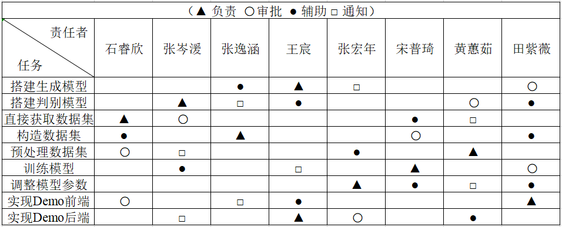
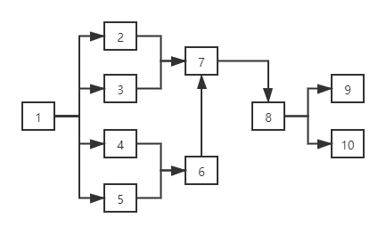
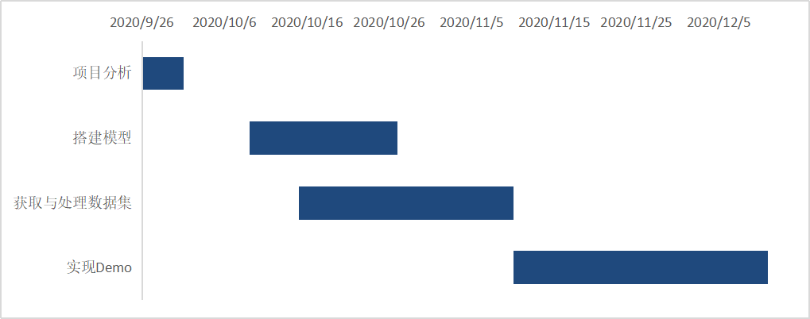

\newpage

\LARGE

\begin{center}
\textbf{项目管理计划书}
\end{center}

\large
\begin{center}
\textbf{\emph{FaceGen: A face image generator website based on GAN}}
\end{center}

# 项目描述
随着互联网的发展，各种应用的出现，人们对塑造个性化的虚拟形象、定制具有某些特征的头像的需求也随之增多，生成的头像可以用于各类应用中，人脸生成这一项任务应运而生。
针对人脸生成任务，我们在项目中将使用TensorFlow搭建一个生成式对抗网络模型，并采用LSUN数据集，ImageNet1k和celebA数据集来对模型进行训练，最终得到能够产生人脸的图像的生成器。并且，在训练好的模型的基础上，我们将会完成一个前端网页，以可视化输入生成器的噪声向量并方便用户调整输入，以及在网页上展示生成器最终生成的图像。

## 项目分解
见表1

\begin{table}
    \caption{项目进度计划}
    \centering
    \begin{tabular}{|p{2.0cm}<{\centering}|p{1.0cm}<{\centering}|p{2.0cm}<{\centering}|p{2.0cm}<{\centering}|p{2.0cm}<{\centering}|}
    \hline
    任务名称     & 耗时（天） & 开始         & 结束         \\ \hline
    \textbf{DCGAN}    & \textbf{76}    & \textbf{2020-9-26}  & \textbf{2020-12-11} \\ \hline
    项目分析     & 5     & 2020-9-26  & 2020-9-31  \\ \hline
    搭建模型     & 18     & 2020-10-9  & 2020-10-27 \\ \hline
    获取与处理数据集 & 26     & 2020-10-15 & 2020-11-10 \\ \hline
    实现Demo   & 31    & 2020-11-10 & 2020-12-11 \\ \hline
    \end{tabular}
\end{table}

## 工作描述
见表2

\begin{table}
    \caption{任务描述}
    \centering
    \begin{tabular}{|p{5.0cm}<{\centering}|p{7.5cm}<{\centering}|}
    \hline
    任务       & 补充说明                                                 \\ \hline
    搭建生成模型   & 使用TensorFlow搭建DCGAN的生成器                             \\ \hline
    搭建判别模型   & 使用TensorFlow搭建DCGAN的判别器                              \\ \hline
    直接获取数据集  & 训练使用的数据集包括LSUN数据集，ImageNet 1k和celebA数据集             \\ \hline
    构造数据集    & 爬取网上社区的图片，通过openface进行修剪来构造数据集                      \\ \hline
    预处理数据集   & 调整图像大小，进行图像标准化处理                                    \\ \hline
    训练模型     & 通过优化目标函数训练模型                                        \\ \hline
    调整模型参数   & 调整参数进行多次训练，在验证集和测试集上进行测试来找到性能最好的参数                  \\ \hline
    实现Demo前端 & 前端需要实现一个网页，主要功能为展示生成的图像，并能显示其对应的输入z；前端网页使用vue框架来实现   \\ \hline
    实现Demo后端 & 后端需要提供相应接口，使网页能够获取图像与对应的输入                          \\ \hline
    \end{tabular}
\end{table}

# 工作责任分配表

# 项目计划工作列表
见表3

\begin{table}
    \caption{工作列表}
    \begin{tabular}{|p{2.0cm}<{\centering}|p{2.0cm}<{\centering}|p{2.0cm}<{\centering}|p{2.0cm}<{\centering}|p{2.0cm}<{\centering}|}
    \hline
    任务编码 & 任务名称     & 紧前工作  & 时间估计（天） & 负责人 \\ \hline
    1    & 项目分析     & —     & 5       & 王宸  \\ \hline
    2    & 搭建生成模型   & 1     & 9       & 王宸  \\ \hline
    3    & 搭建判别模型   & 1     & 9       & 张岑湲 \\ \hline
    4    & 直接获取数据集  & 1     & 5       & 石睿欣 \\ \hline
    5    & 构造数据集    & 1     & 9       & 张逸涵 \\ \hline
    6    & 预处理数据集   & 4、5   & 6       & 黄蕙茹 \\ \hline
    7    & 训练模型     & 2、3、6 & 3       & 宋普琦 \\ \hline
    8    & 调整模型参数   & 7     & 5       & 张宏年 \\ \hline
    9    & 实现Demo前端 & 1     & 14      & 田紫薇 \\ \hline
    10   & 实现Demo后端 & 1     & 17      & 王宸  \\ \hline
    \end{tabular}
\end{table}

# 项目网络图

# 甘特图

# PERT时间分析
根据计划评审技术推测，
